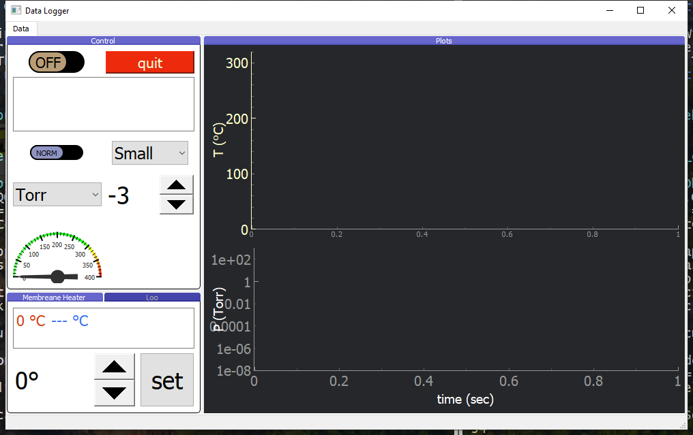

# Data Logger and controller for Raspberry Pi

# Intro

There are commercially available data loggers and temperature control units, however sometimes it is nice to have all things you need in one place, and with a tailored UI. Also, the price for commercial data loggers could be several times higher then a simple SPC alternative.


In our project, we have an experimental device where we want to measure several signals, plus to implement a feed-back control of a sensor temperature. 


Hardware components:

- [Raspberry Pi 3 Model B](https://www.raspberrypi.org/products/raspberry-pi-3-model-b/)
- 16 bit 32 channel Analog to Digital Convertor (DAC) [I2C アナログ入力ボード AIO-32/0RA-IRC](https://www.y2c.co.jp/i2c-r/aio-32-0ra-irc/)
- Solid-state relay Celduc [SO842074](https://docs.rs-online.com/4deb/0900766b8050bf44.pdf)
- Halogen Lamp Panasonic [JCD100V300WCG](https://www2.panasonic.biz/scvb/a2A/opnItemDetail?use_obligation=scva&contents_view_flg=1&catalog_view_flg=1&item_cd=JCD100V300WCG&item_no=JCD100V300WCG&b_cd=101&hinban_kbn=1&s_hinban_key=JCD100V300WCG&s_end_flg=&vcata_flg=1) as a heating element
- 7'' touch screen as indicator and control input device [B07PY5XND3]([https://www.amazon.co.jp/2019%E6%9C%80%E6%96%B0%E7%89%88-Raspberry-Pi%E7%94%A8%E3%82%BF%E3%83%83%E3%83%81%E3%83%A2%E3%83%8B%E3%82%BF%E3%83%BC-%E3%83%A2%E3%83%90%E3%82%A4%E3%83%AB%E3%83%A2%E3%83%8B%E3%82%BF%E3%83%BC-%E3%83%A2%E3%83%90%E3%82%A4%E3%83%AB%E3%83%87%E3%82%A3%E3%82%B9%E3%83%97%E3%83%AC%E3%82%A4/dp/B07PY5XND3](https://www.amazon.co.jp/2019最新版-Raspberry-Pi用タッチモニター-モバイルモニター-モバイルディスプレイ/dp/B07PY5XND3))


The analog signals from vacuum gauges, 0 - 10 V, and the K-type thermocouple, 0 - 15 mV, are red by the DAC in the worker thread. The Raspi GPIO are used to control the solid state relay and turn on the halogen lamp. A Variac is used to power the lamp.  





### requirements
```
- pyqtgraph
- numpy
- scipy
- matplotlib
- pandas
- python3-smbus
- RPi.GPIO
```

### start Logger
```
$ pyton3 main.py
```

### Data folder

The data folder name and location is stored in the settings file, .setings - a csv file. By default the data folder is placed relatively to the parent directory in <makr>../data</mark>.